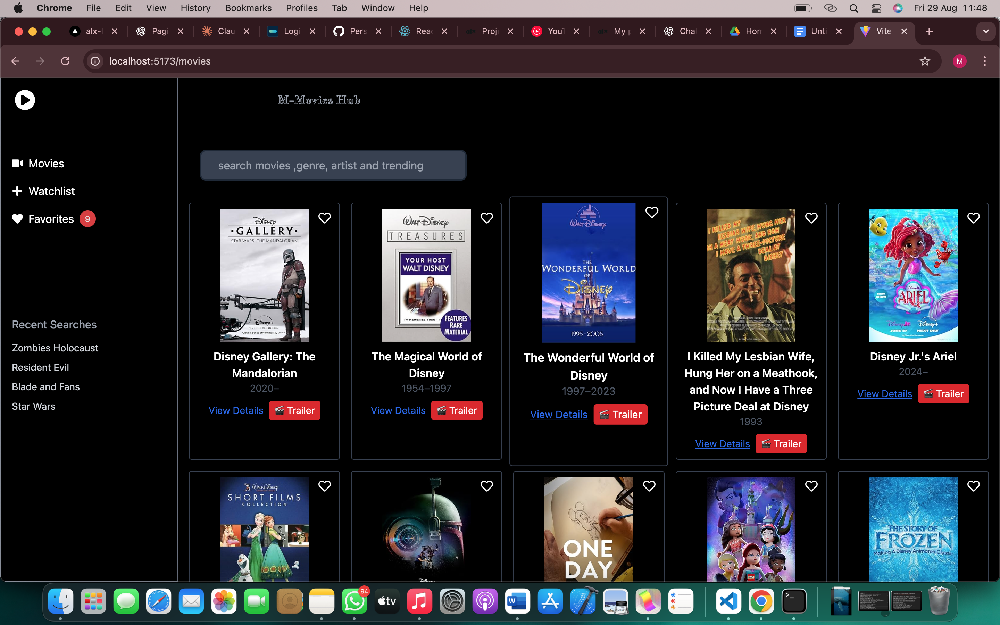

# 🎬 Movie Discovery App

A modern, responsive movie discovery application built with React that allows users to search for movies, view details, watch trailers, and manage their favorite films.



✨ Features

 🔍 **Movie Search**
- Search movies by title, genre, artist, or trending keywords
- Real-time search with loading states
- Pagination support with "Load More" functionality
- Random movie suggestions on initial load

🎥 **Movie Details**
- Comprehensive movie information display
- High-quality movie posters with fallback placeholders
- Release year and basic movie metadata
- Detailed view modal for expanded information

 🎬 **Trailer Integration**
- Watch official movie trailers directly in the app
- YouTube embed player with autoplay
- Modal overlay with backdrop click-to-close
- Fallback handling when trailers aren't available

 ❤️ **Favorites System**
- Add/remove movies from personal favorites
- Persistent favorites using Zustand state management
- Heart icon toggle with visual feedback
- Automatic fetching of complete movie details when favoriting

🎨 **User Experience**
- Dark theme design
- Responsive grid layout (2/3/5 columns based on screen size)
- Smooth hover animations and transitions
- Error handling with user-friendly messages
- Image error handling with placeholder fallbacks

🛠️ Tech Stack

- **Frontend Framework**: React 18
- **Build Tool**: Vite
- **Styling**: Tailwind CSS
- **State Management**: Zustand
- **HTTP Client**: Axios
- **Icons**: React Icons (Font Awesome)
- **APIs**: 
  - OMDb API (movie search and details)
  - The Movie Database (TMDb) API (trailers)

📋 Prerequisites

Before running this project, make sure you have:

- Node.js (version 16.0 or higher)
- npm or yarn package manager
- OMDb API key (free from [omdbapi.com](http://www.omdbapi.com/))
- TMDb API key (free from [themoviedb.org](https://www.themoviedb.org/))

 🚀 Installation & Setup

1. Clone the Repository
```bash
git clone https://github.com/yourusername/movie-discovery-app.git
cd movie-discovery-app
```

### 2. Install Dependencies
```bash
npm install
# or
yarn install
```

### 3. Environment Configuration
Create a `.env` file in the root directory:
```env
VITE_OMDB_API_KEY=your_omdb_api_key_here
VITE_TMDB_API_KEY=your_tmdb_api_key_here
```

### 4. Get Your API Keys

#### OMDb API Key:
1. Visit [omdbapi.com](http://www.omdbapi.com/apikey.aspx)
2. Choose the FREE tier (1,000 requests/day)
3. Enter your email and verify
4. Copy your API key

#### TMDb API Key:
1. Create account at [themoviedb.org](https://www.themoviedb.org/)
2. Go to Settings → API
3. Request API key (Developer option)
4. Fill out the form (can use "Learning Project" as description)
5. Copy your API key

### 5. Run the Development Server
```bash
npm run dev
# or
yarn dev
```

Visit `http://localhost:5173` to view the application.

## 📁 Project Structure

```
src/
├── components/
│   ├── Search.jsx          # Main search component
│   ├── MovieDetails.jsx    # Movie details modal
│   └── stores/
│       └── favoritesStore.js # Zustand favorites store
├── services/
│   ├── omdbService.js      # OMDb API integration
│   └── trailerService.js   # TMDb trailer API integration
├── App.jsx                 # Root component
├── main.jsx               # Application entry point
└── index.css              # Global styles & Tailwind imports
```

## 🔧 Configuration

### API Service Configuration

The app uses two APIs configured in the services directory:

**OMDb Service** (`services/omdbService.js`):
- Handles movie search and basic details
- Provides movie posters, titles, years
- Free tier: 1,000 requests per day

**TMDb Service** (`services/trailerService.js`):
- Fetches official movie trailers
- Converts OMDb IDs to TMDb IDs
- Provides YouTube trailer links
- Free tier: Very generous limits

### State Management

**Favorites Store** (`stores/favoritesStore.js`):
- Uses Zustand for lightweight state management
- Persists favorites in localStorage
- Provides `isFavorite` and `toggleFavorite` functions

## 🎯 Usage

### Searching Movies
1. Enter movie title, genre, or keyword in the search bar
2. Press Enter or wait for auto-search
3. Use "Load More" button to see additional results

### Viewing Details
- Click "View Details" on any movie card
- Modal opens with comprehensive movie information
- Click outside modal or close button to dismiss

### Watching Trailers
- Click the "🎬 Trailer" button on any movie card
- Trailer opens in a modal with YouTube player
- Click outside or close button to exit

### Managing Favorites
- Click the heart icon to add/remove from favorites
- Filled red heart = favorited
- Empty heart = not favorited
- Favorites persist between sessions

## 🚀 Build & Deploy

### Build for Production
```bash
npm run build
# or
yarn build
```

### Deploy to Netlify
1. Build the project
2. Upload `dist` folder to Netlify
3. Add environment variables in Netlify dashboard

### Deploy to Vercel
1. Connect GitHub repository to Vercel
2. Add environment variables in Vercel dashboard
3. Deploy automatically on push

## 🔍 API Limits & Considerations

### OMDb API
- **Free Tier**: 1,000 requests/day
- **Rate Limit**: No specific rate limiting
- **Best Practice**: Cache search results, avoid duplicate requests

### TMDb API
- **Free Tier**: 40 requests per 10 seconds
- **Daily Limit**: Very high (typically not reached)
- **Best Practice**: Cache trailer data per movie

## 🐛 Troubleshooting

### Common Issues

**"Movie not found" errors:**
- Check if OMDb API key is correctly set
- Verify API key is valid and not expired
- Some movies may not be available in OMDb database

**Trailer not loading:**
- TMDb API key might be incorrect
- Some movies may not have trailers available
- Check browser console for API errors

**Images not displaying:**
- OMDb sometimes returns "N/A" for poster URLs
- App includes fallback placeholder handling
- Check network connection

### Error Boundaries
The app includes error handling for:
- API failures
- Image loading errors
- Network connectivity issues
- Invalid search queries

## 🤝 Contributing

1. Fork the repository
2. Create your feature branch (`git checkout -b feature/amazing-feature`)
3. Commit your changes (`git commit -m 'Add some amazing feature'`)
4. Push to the branch (`git push origin feature/amazing-feature`)
5. Open a Pull Request

## 📄 License

This project is licensed under the MIT License - see the [LICENSE](LICENSE) file for details.

## 🙏 Acknowledgments

- [OMDb API](http://www.omdbapi.com/) for movie data
- [The Movie Database](https://www.themoviedb.org/) for trailer information
- [Tailwind CSS](https://tailwindcss.com/) for styling
- [React Icons](https://react-icons.github.io/react-icons/) for beautiful icons

## 📞 Support

If you encounter any issues or have questions:

1. Check the [Issues](https://github.com/yourusername/movie-discovery-app/issues) page
2. Create a new issue with detailed description
3. Include error messages and steps to reproduce

---

**Happy movie discovering! 🍿**